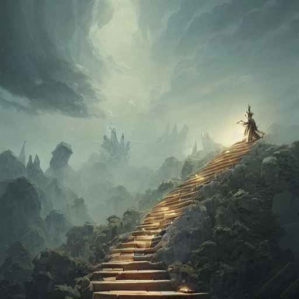

# Text-to-Image-Translation




- Oil paining of robotic humanoid ( pale shani from witcher 3 ), intricate mechanisms, highly detailed, professional digital painting, unreal engine 5, photorealism, hd quality, 8 k resolution, cinema 4 d, 3 d, cinematic, professional photography, art by artgerm and greg rutkowski and alphonse mucha and loish and wlop

  

- portrait of a cosmic goddess, suit made out of stars and galaxies and cosmic energy, intricate, headshot, highly detailed, digital painting, artstation, concept art, sharp focus, cinematic lighting, illustration, art by artgerm and greg rutkowski, alphonse mucha, cgsociety

  

- skeleton black bones!!, covered with blood, alexandra daddario face!!, long red hair, ultra realistic, concept art, intricate details, highly detailed, photorealistic, octane render, 8 k, unreal engine. retro film still, heavy grain, 3 5 mm, art by artgerm and greg rutkowski and alphonse mucha 

  

- endless stairs made of books leading to heaven, sky full of clouds, art by greg rutkowski and peter mohrbacher, featured in artstation, octane render, cinematic, elegant, intricate, ultra detailed, rule of thirds, professional lighting, unreal engine, fantasy, concept art, sharp focus, illustration, 8 k 


### Create SSH connection connect
##### generate RSA public key
```bash
ssh-keygen -t rsa -f tharhtetsan -C tharhtet1234@gmail.com
```

##### connect ssh to remote server
```bash
ssh -i tharhtetsan tharhtet@34.171.245.255
```

##### add config in VS code
```bash
Host 34.171.245.255
  HostName 34.171.245.2
  User tharhtet.3
  IdentityFile C:\Users\tharh\tharhtet3\tharhtetsan
```


### Install docker
```bash
 sudo dpkg --configure -a
 sudo apt update
 sudo curl -sSL https://get.docker.com/ | sh

```

##### Monitor GPU

```
nvidia-smi -l 1
```

